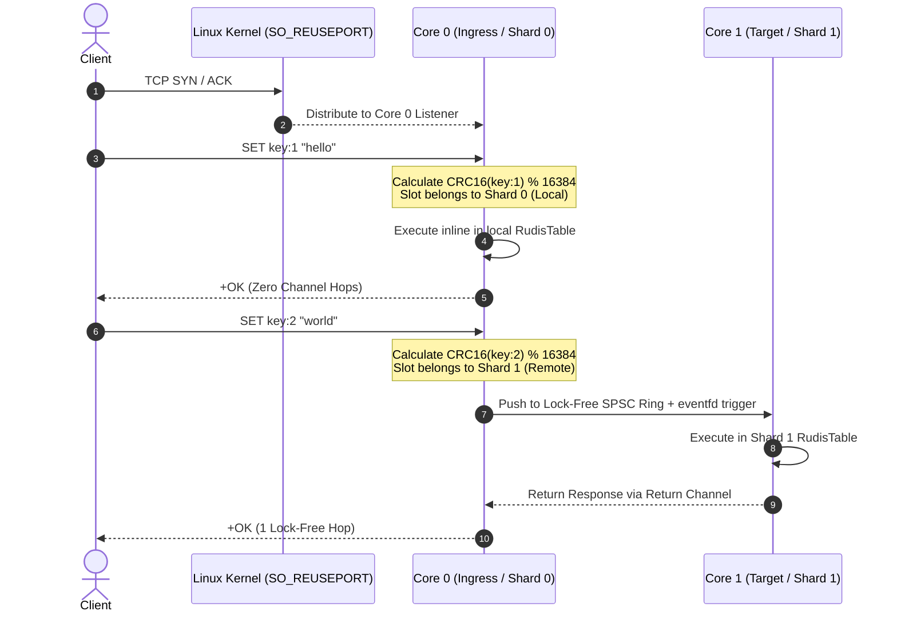

# Rudis Architecture & Threading Model

Rudis is an ultra-high-performance in-memory and NVMe-tiered datastore built for modern multi-core, high-throughput cloud workloads. It scales vertically on a single node across dozens of physical cores to serve multi-million operations per second with sub-millisecond tail latencies.

---

## 1. Threading Model

Rudis employs a **Thread-Per-Core (Shared-Nothing)** multi-reactor architecture built natively on Linux `io_uring` via the `monoio` asynchronous runtime.

```
                     Client Requests (RESP2 / RESP3 / Memcached)
                                          │
           ┌──────────────────────────────┴──────────────────────────────┐
           │                Linux Kernel Networking Layer                │
           │   • SO_REUSEPORT Connection Balancing (Zero Userspace Hop)  │
           │   • AF_XDP (XSK) Zero-Copy UMEM Rings & eBPF XDP Filtering  │
           │   • Hardware Kernel TLS Acceleration (kTLS / TCP_ULP)       │
           └──────────────┬──────────────────────────────┬───────────────┘
                          │                              │
         ┌────────────────▼─────────────┐      ┌─────────▼────────────────────┐
         │       Core 0 (Shard 0)       │      │     Core N-1 (Shard N-1)     │
         │  ┌────────────────────────┐  │      │  ┌────────────────────────┐  │
         │  │ Monoio Runtime         │  │      │  │ Monoio Runtime         │  │
         │  │ (Independent io_uring) │  │      │  │ (Independent io_uring) │  │
         │  └───────────┬────────────┘  │      │  └───────────┬────────────┘  │
         │              ▼               │      │              ▼               │
         │  ┌────────────────────────┐  │      │  ┌────────────────────────┐  │
         │  │ Connection & Protocol  │  │      │  │ Connection & Protocol  │  │
         │  │ • Zero-Copy RESP Parser│  │      │  │ • Zero-Copy RESP Parser│  │
         │  │ • Memcached Gateway    │  │      │  │ • Memcached Gateway    │  │
         │  └───────────┬────────────┘  │      │  └───────────┬────────────┘  │
         │              ▼               │      │              ▼               │
         │  ┌────────────────────────┐  │      │  ┌────────────────────────┐  │
         │  │ Local Thread Storage   │  │      │  │ Local Thread Storage   │  │
         │  │ • In-Memory RudisTable │  │      │  │ • In-Memory RudisTable │  │
         │  │ • RangeTree & Search   │  │      │  │ • RangeTree & Search   │  │
         │  │ • HNSW (SQ8/PQ Vectors)│  │      │  │ • HNSW (SQ8/PQ Vectors)│  │
         │  │ • RedisJSON / Streams  │  │      │  │ • RedisJSON / Streams  │  │
         │  └───────────┬────────────┘  │      │  └───────────┬────────────┘  │
         │              ▼               │      │              ▼               │
         │  ┌────────────────────────┐  │      │  ┌────────────────────────┐  │
         │  │ NVMe Tiering SmallBins │  │      │  │ NVMe Tiering SmallBins │  │
         │  │ • Direct I/O (O_DIRECT)│  │      │  │ • Direct I/O (O_DIRECT)│  │
         │  └────────────────────────┘  │      │  └────────────────────────┘  │
         └──────────────┬───────────────┘      └──────────────┬───────────────┘
                        │                                     │
           ┌────────────▼─────────────────────────────────────▼──────────┐
           │                  Lock-Free Cross-Shard Mesh                 │
           │   • SPSC Channel Rings with EventFD Cross-Core Wakers       │
           │   • Striped Shard Presence Bitmask (Redis 7 Sharded Pub/Sub)│
           │   • Parallel Pipeline Squashing (Batched Multi-Key Dispatch)│
           └────────────┬─────────────────────────────────────┬──────────┘
                        │                                     │
                        ▼                                     ▼
         ┌──────────────────────────────┐      ┌──────────────────────────────┐
         │ Per-Shard Parallel TCP Flow  │      │ Fork-less io_uring Snapshots │
         │ • Dedicated DFLY FLOW Socket │      │ • Streaming Sequential RDB   │
         │ • Direct Worker Streaming    │      │ • ioctl(FICLONE) Reflink     │
         └──────────────────────────────┘      └──────────────────────────────┘
```

### Key Concurrency Principles:
1. **Physical Core Pinning**: Every worker thread is pinned to an exclusive physical CPU core via `core_affinity`. The OS scheduler cannot migrate worker threads between cores, ensuring 100% L1/L2 cache locality and eliminating NUMA memory hopping.
2. **Independent Event Loops**: Each core runs its own dedicated `monoio` event loop driving an isolated Linux `io_uring` instance. No global event loop or multiplexer exists.
3. **Ingress with `SO_REUSEPORT`**: Every shard thread creates its own TCP listener on the same port (`6379`) with `SO_REUSEPORT` enabled. The Linux kernel distributes incoming client connections across the worker threads using a 4-tuple hash (`src_ip, src_port, dst_ip, dst_port`) with zero userspace locking or proxy hops.
4. **Thread-Local Storage**: State is strictly thread-local (`ShardDb`). Local operations execute in nanoseconds against a thread-local hash table with **zero mutexes, zero atomic operations, and zero cross-core cache invalidations**.

---

## 2. Primary Data Structures

| Type | Location | Architectural Role |
| :--- | :--- | :--- |
| `ShardDb` | `src/shard.rs` | Encapsulates all thread-local state: `RudisTable`, secondary indices, AOF handle, and tiering cache. |
| `RudisTable` | `src/table.rs` | Custom cache-conscious hash table optimized for 64-byte CPU cache lines with SIMD probing. |
| `Router` | `src/router.rs` | Coordinates slot routing (`CRC16(key) % 16384`), cross-shard mailbox dispatch, and pipeline squashing. |
| `ShardSender` / `ShardReceiver` | `src/mailbox.rs` | Lock-free bounded SPSC channel ring paired with an `eventfd` waker to resume idle target cores. |
| `Connection` | `src/connection.rs` | Manages per-connection I/O, pipelining, RESP2/RESP3 framing, and Memcached protocol auto-detection. |
| `RangeTree` | `src/search.rs` | Balanced B-tree numeric indexing structure providing $O(\log N + K)$ search and $O(1)$ term deletion. |
| `SmallBins` | `src/tiering/smallbins.rs`| Coalesces sub-4KB cold values into aligned 4KB disk blocks for NVMe direct I/O (`O_DIRECT`). |

---

## 3. Life of a Command Request

When a client sends a command to Rudis, it is processed through one of two execution paths depending on key ownership:



### Local Fast Path (Zero Channel Hops):
1. Client connection on Core 0 reads incoming RESP payload from socket into registered buffer.
2. In-place zero-copy RESP parser extracts command arguments without heap allocation.
3. Key slot is calculated via `CRC16(key) % 16384`.
4. If `slot` is mapped to Shard 0, the command executes **immediately and inline** against the local `ShardDb`.
5. Response frame is written directly into the connection's TCP write buffer.

### Remote Path (Lock-Free Cross-Shard Dispatch):
1. If the key belongs to Shard 1, Core 0 encapsulates the command in a `ShardMessage` envelope.
2. Core 0 pushes the message into the bounded lock-free SPSC channel leading to Shard 1.
3. If Shard 1 is asleep in `io_uring_enter`, Core 0 issues an atomic write to Shard 1's `eventfd` to wake its reactor.
4. Shard 1 dequeues the message, executes against its local `ShardDb`, and returns the result back to Core 0.
5. Core 0 flushes the response to the client socket.

---

## 4. Parallel Cross-Shard Pipeline Squashing

When a client sends pipelined requests or multi-key commands (`MGET`, `MSET`, `DEL`), naive implementations dispatch requests sequentially or one key at a time, incurring $O(K)$ channel round-trips.

Rudis implements **Parallel Pipeline Squashing**:

```
                       Client Pipelined Batch: [GET k1, SET k2, GET k3, GET k4]
                                                 │
                               ┌─────────────────┴─────────────────┐
                               ▼                                   ▼
                     Shard 0 (Local Keys)                Shard 1 (Remote Keys)
                     • GET k1                            • SET k2
                     • GET k3                            • GET k4
                               │                                   │
                     Execute Inline (0 hops)             Single Batched SPSC Hop
                               │                                   │
                               └─────────────────┬─────────────────┘
                                                 ▼
                               Merged Pipeline Response Stream to Client
```

1. **Batch Partitioning**: All commands in a pipeline are parsed in a single sweep and bucketed by destination shard.
2. **Local Inline Processing**: All commands targeted at the local shard execute immediately with zero hops.
3. **One Hop Per Target Core**: For every remote shard involved, commands are bundled into a single `ShardMessage::Batch` hop.
4. **Scatter-Gather Parallelism**: Destination shards process their sub-batches in parallel. Core 0 collects responses and streams them in the original client sequence.
