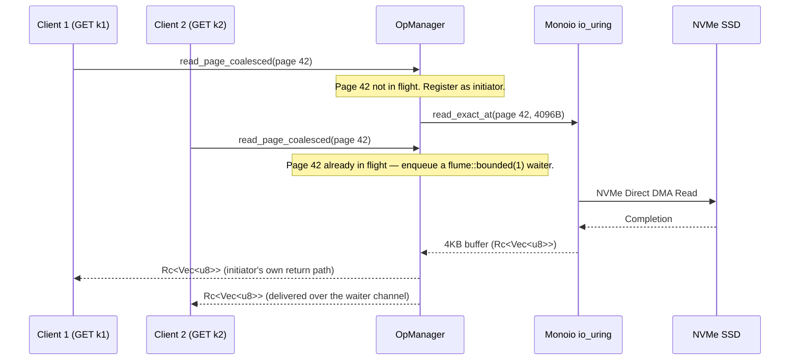

# Design Document: NVMe SSD Tiered Storage Engine for `rudis` (Dragonfly-Inspired)

> **Implemented in**: `src/tiering.rs` (core stash/read/GC/snapshot primitives), with the
> orchestration layer in `src/router.rs` and the `RudisValue::Tiered`/`RudisValue::Cooled`
> state machine in `src/table.rs`.
> **Companion docs**: [`docs/design/07_nvme_tiering.md`](07_nvme_tiering.md) (concise
> architectural summary) and [`docs/internal/07_nvme_tiering.md`](../internal/07_nvme_tiering.md)
> (struct-level implementation reference).

> **Document status.** This is the original deep-dive design spec for tiered storage,
> written against Dragonfly's `dfly::tiering::*` implementation as a reference model. A
> substantial, working subset has since shipped in `src/tiering.rs`/`src/router.rs`/`src/table.rs`
> and is described here as **Implemented**. The original proposal was more ambitious than what
> shipped in several places — a packed-pointer/union in-memory representation, an
> intrusive LRU cooling queue, and a mimalloc-style segment allocator with free-range reuse were
> all part of the original plan but were **not built**; the shipped design solves the same
> problems with simpler, append-only/table-scan mechanisms instead. Every subsection below is
> labeled **Implemented** (verified against current source) or **Not Implemented — Future Work**
> (the original proposal, not present in the codebase today) so this document can keep serving as
> both a historical design record and an accurate description of current behavior.

---

## 1. Executive Summary & Motivation

Modern in-memory stores like Redis deliver sub-millisecond response times by keeping all data in DRAM. However, DRAM is expensive (roughly $4–$6/GB at the time this design was written), power-hungry, and strictly capacity-limited. Modern NVMe SSDs offer hundreds of thousands to millions of IOPS with read latencies in the 10–30 microsecond range at a fraction of DRAM's cost per gigabyte. These are general hardware-market figures cited for motivation, not measurements of `rudis` itself.

In typical cache and database workloads, key access follows a Zipfian/Pareto distribution: a minority of keys account for the large majority of requests. The remainder is cold or cooling data that wastes expensive DRAM if kept resident.

Studying Dragonfly's production SSD data-tiering architecture motivated the following goals for `rudis`:
- **Larger-than-memory capacity**: transparently scale datasets beyond physical DRAM by offloading cold values to local NVMe.
- **Thread-per-core, shared-nothing I/O**: each `rudis` shard drives its own `monoio`/`io_uring` event loop and owns a dedicated per-shard backing file, with no cross-shard locks on the storage path.
- **Three-state value lifecycle (Hot / Cooled / Tiered)**: instant, zero-I/O memory reclamation for values that are already resident on disk.
- **Small-value bin packing (`SmallBins`)**: coalesce sub-4KB items into 4KB-aligned pages to avoid the write/space amplification that direct I/O would otherwise impose on tiny values.
- **Page read coalescing (`OpManager`)**: deduplicate concurrent reads that land on the same 4KB disk page.
- **Direct I/O (`O_DIRECT`)**, where the platform and filesystem support it: bypass the Linux page cache to avoid double caching and to make the in-process `SmallBins`/read-coalescing layer the single cache, rather than fighting the kernel's own.

Of these, the three-state lifecycle, SmallBins packing, `OpManager` read coalescing, and opportunistic Direct I/O are **Implemented**. A separate, more elaborate on-disk space allocator (§8) was proposed but **not implemented** — see that section for what ships instead.

---

## 2. Dragonfly Architectural Mapping — Implemented vs. Proposed

Inspection of Dragonfly's implementation (`dragonfly/src/server/tiering/*` and `core/compact_object.h`) motivated six conceptual pillars. The table below reflects what actually shipped in `rudis`, not the original proposal (see the strikethrough-style "originally proposed" column for context on what was scoped down):

| Pillar | Dragonfly | Originally proposed for `rudis` | **What actually shipped** |
| :--- | :--- | :--- | :--- |
| In-memory pointer | `CompactObj::ExternalPtr` (16B packed) | `RudisExternalPtr` (16B packed, bitfields + union) | **Implemented, simpler form**: `TieredPointer` (`src/table.rs`) — a plain 17-byte `{file_id: u32, offset: u64, length: u32, value_type: u8}` struct, no bit-packing or union. Held inline in `RudisValue::Tiered(TieredPointer)` / `RudisValue::Cooled { ptr, val }`. |
| Cooling buffer | `TieredCoolRecord` (48B, intrusive LRU) | `CoolRecord` in an intrusive doubly-linked LRU list | **Not Implemented — Future Work**. The "cooled" state is not a separate LRU-managed structure; it is the `RudisValue::Cooled { ptr, val }` enum variant living directly in the hash table slot next to every other value. There is no LRU ordering — eviction to the `Tiered` state is either targeted (`TIER DECOMMIT <key>`) or a full-table sweep (`TIER DECOMMIT` / `decommit_local(None)`), not an LRU pop. |
| Small-value packing | `SmallBins` (4KB page packing) | `SmallBins` with a page-header + index-table + value-blob layout | **Implemented, different on-disk layout**: `ActiveBin`/`SmallBinsManager` pack self-describing records (§6) sequentially into a 4KB buffer; there is no separate page header or index table region on disk. |
| Read coalescing & ops mgmt | `OpManager` | `TieredOpManager` over Monoio futures | **Implemented**: `OpManager` (`src/tiering.rs`) — in-flight page-read deduplication and pending-stash tracking, built directly on `flume` channels and `monoio::fs::File`. |
| Disk space allocator | `ExternalAllocator` (mimalloc-style segments) | `ExternalAllocator` with a `BTreeMap`-based range tree | **Not Implemented — Future Work**. There is no segment/page-class allocator and no free-range reuse. Space is a monotonically increasing `current_offset: Cell<u64>` cursor; `fallocate(FALLOC_FL_PUNCH_HOLE)` returns dead pages' physical blocks to the filesystem as a sparse-file hole, but that logical offset range is never reused by future writes (§8). |
| Direct I/O driver | `io_uring` via `UringProactor` | `monoio::IoUringDriver` + `O_DIRECT` | **Implemented, opt-in**: `ShardTierManager::open` attempts `O_DIRECT` only if `RUDIS_DIRECT_IO` is set to something other than `"0"`, and silently falls back to a buffered open if the `O_DIRECT` open call fails. |

---

## 3. High-Level System Architecture — Implemented

Each shard is pinned to a physical core and runs an isolated `monoio` event loop driving an independent `io_uring` ring, with its own backing file:

```text
                           Client Connections
                                   │
                     (SO_REUSEPORT Kernel Balancing)
                      ┌────────────┴────────────┐
                      ▼                         ▼
              ┌───────────────┐         ┌───────────────┐
              │    Core 0     │         │    Core 1     │
              │ Monoio Runtime│         │ Monoio Runtime│
              │ (io_uring)    │         │ (io_uring)    │
              ├───────────────┤         ├───────────────┤
              │    Shard 0    │         │    Shard 1    │
              │  RudisTable   │         │  RudisTable   │
              ├───────────────┤         ├───────────────┤
              │ ShardTierMgr  │         │ ShardTierMgr  │
              │ ┌───────────┐ │         │ ┌───────────┐ │
              │ │ OpManager │ │         │ │ OpManager │ │
              │ ├───────────┤ │         │ ├───────────┤ │
              │ │ SmallBins │ │         │ │ SmallBins │ │
              │ └───────────┘ │         │ └───────────┘ │
              └───────┬───────┘         └───────┬───────┘
                      │ (opportunistic O_DIRECT) │
                      ▼                         ▼
              ┌───────────────┐         ┌───────────────┐
              │ tier_shard_0  │         │ tier_shard_1  │
              │     .db       │         │     .db       │
              └───────────────┘         └───────────────┘
```

Each shard's file lives at `<RUDIS_TIER_DIR>/tier_shard_<shard_id>.db`; `RUDIS_TIER_DIR` defaults
to `$TMPDIR/rudis_tier_<port>` if the environment variable is unset. A `ShardTierManager` is
opened for **every** shard unconditionally at startup, independent of whether `maxmemory` is
configured — the automatic offload/decommit path simply never triggers if `maxmemory` is 0.
There is no `ExternalAllocator` layer between `ShardTierManager` and the raw file (§8).

---

## 4. In-Memory Data Structures

### 4.1 `TieredPointer` — Implemented

`src/table.rs` defines the actual in-memory pointer type held inline in `RudisValue`:

```rust
#[derive(Clone, Copy, Debug, PartialEq, Eq)]
pub struct TieredPointer {
    pub file_id: u32,   // currently always the owning shard's shard_id
    pub offset: u64,    // byte offset into that shard's tier_shard_<id>.db
    pub length: u32,    // encoded record length on disk (see §6.2)
    pub value_type: u8, // discriminant for RudisValue::{String,Int,List,Set,ZSet,...}
}

#[derive(Clone, Debug, PartialEq, Eq)]
pub enum RudisValue {
    // ...
    Tiered(TieredPointer),
    Cooled { ptr: TieredPointer, val: Box<RudisValue> },
}
```

This is a plain, unpacked 17-byte struct (4 + 8 + 4 + 1) — no bitfields, no union, no
representation tag squeezed into spare bits. It replaces the original in-memory value only for
the `Tiered` variant; `Cooled` additionally boxes the full decoded value alongside the pointer, so
a cooled entry costs strictly more RAM than a plain hot value, not less (the RAM savings only
materialize once a key transitions all the way to `Tiered`).

### 4.2 `RudisExternalPtr` / `CoolRecord` (packed pointer + intrusive LRU) — Not Implemented, Future Work

The original design proposed a packed 16-byte pointer with bitfields for page offset, a
"cooling" flag, and a representation tag, plus a `union` distinguishing an in-memory
`CoolRecord*` from an on-disk `ColdLocation`, backed by an intrusive doubly-linked LRU list for
the cooling buffer:

```rust
// NOT IMPLEMENTED — illustrative only, no code in src/ matches this shape.
#[repr(C, packed)]
pub struct RudisExternalPtr {
    pub serialized_size: u32,
    pub flags_and_offset: u16,  // page_offset | is_cool | representation | reserved
    pub header_bytes: [u8; 2],
    pub location: ExternalLocation,  // union { cold: ColdLocation, cool_record: *mut CoolRecord }
}

pub struct CoolRecord {
    pub key_hash: u64,
    pub value: Bytes,
    pub page_index: u32,
    pub db_index: u16,
    pub prev: *mut CoolRecord,
    pub next: *mut CoolRecord,
}
```

Advantages this would have offered over the shipped design: a smaller resident pointer (16B vs.
17B is marginal, but the packed layout also avoids the `Box<RudisValue>` allocation that `Cooled`
currently carries), and true LRU-ordered eviction instead of the round-robin/full-sweep
selection actually used (§5). Neither is implemented; raw pointers into an intrusive list would
also be a meaningfully larger unsafe-code surface than the current design's plain, safe struct —
a real trade-off, not just unfinished work.

---

## 5. Three-State Lifecycle — Implemented, with a Different Eviction Mechanism Than Originally Proposed

```mermaid
stateDiagram-v2
    [*] --> Hot: SET (new key)
    Hot --> Cooled: cool_local (stash to disk, keep RAM copy)
    Hot --> Tiered: spill_local (stash to disk, drop RAM copy)
    Cooled --> Tiered: decommit_local (drop RAM copy; zero I/O)
    Tiered --> Cooled: load_local (read from disk; RAM copy retained)
    Tiered --> [*]: DEL / Expire (free disk segment)
    Cooled --> [*]: DEL / Expire (free RAM + disk segment)
    Hot --> [*]: DEL / Expire (free RAM)
```



Two corrections relative to the original proposal:

1. **`Hot` can transition directly to either `Cooled` or `Tiered`**, not only to `Cooled` first.
   `Router::spill_local` (used by the automatic `check_auto_tier` eviction path and by
   `TIER SPILL`) stashes to disk *and* drops the RAM copy in one step — it does not pass through
   `Cooled`. `Router::cool_local` (used by `TIER COOL`) stashes to disk but *keeps* the RAM copy,
   landing directly in `Cooled`. Both write to the same `ShardTierManager::stash_record`.
2. **A `Tiered` read always lands back in `Cooled`, never straight back to `Hot`.**
   `Router::load_local` calls `RudisTable::restore_tiered_value`, which sets the slot to
   `RudisValue::Cooled { ptr, val }` — i.e. once a key has ever been tiered, every subsequent read
   that promotes it keeps paying the bookkeeping cost of `TieredPointer` alongside the RAM value
   until something explicitly decommits it again. There is no direct `Tiered → Hot` transition in
   the code today (flagged as future work in the internal implementation doc).

### 5.1 "Zero-I/O decommit" — Implemented, but full-sweep rather than per-key LRU pop

The original proposal described decommit as popping individual `CoolRecord` items off an LRU
list until enough RAM is freed. The shipped mechanism is coarser but still genuinely zero-I/O:
`Router::decommit_local` either targets one specific key (`decommit_cooled_key`, called by
`TIER DECOMMIT <key>`) or walks **every** hash-table slot and decommits **every** `Cooled` entry
in one pass (`decommit_all_cooled`, called by `TIER DECOMMIT` with no key, and as the first step
of the automatic `check_auto_tier` sweep). In both cases the underlying operation is identical to
the original design's intent — overwrite the slot's value with just the `TieredPointer`, drop the
boxed `RudisValue`, no disk I/O — but selection is "one specific key" or "all of them", not an
LRU-ordered incremental reclaim.

### 5.2 Hot-key spill candidate selection — Implemented, round-robin rather than sampling

When decommitting all `Cooled` entries isn't enough to get a shard back under its memory budget,
`check_auto_tier`'s second phase spills up to 256 additional `Hot` keys via
`RudisTable::get_hot_keys_for_spill`. This walks the table's slot array starting from a
persistent `spill_cursor` that advances across calls (a simple round-robin/clock scan), collecting
the first non-`Tiered`/non-`Cooled` keys it finds — there is no size filter, no sampling, and no
access-recency heuristic; it is closer to a FIFO-ish sweep than either LRU or random sampling.

---

## 6. Small Values Aggregation (`SmallBins`) — Implemented, Different On-Disk Layout

Direct I/O (`O_DIRECT`), when active, requires page-aligned reads and writes. Storing every small
value (well under 4KB) as its own standalone 4KB-aligned block would multiply space and I/O
amplification, so values under a threshold are packed multiple-to-a-page.

### 6.1 On-disk record format — self-describing, not a page-header + index-table layout

`src/tiering.rs::encode_tiered_record` produces one self-contained record per value:

```text
+------------------------------------------------------------------------------+
|  TIER_MAGIC (4B, "TIER") | value_type (1B) | key_len (4B LE) | val_len (4B LE)|
|  crc64 (8B LE, over key+val_payload) | key bytes | value payload bytes       |
+------------------------------------------------------------------------------+
```

A `SmallBins` page (`ActiveBin::buffer`, `src/tiering.rs`) is simply a sequence of these
self-describing records concatenated up to `PAGE_SIZE` (4096 bytes) and zero-padded to the
boundary on seal — **there is no separate page header or key-metadata index table on disk.**
Readers do not need to parse an index: the in-memory `TieredPointer` already carries the exact
`(offset, length)` of the target record, and `decode_tiered_record` validates the magic bytes,
expected `value_type`, and a CRC64 checksum before trusting the payload — a corrupt or torn write
surfaces as an `io::Error`, not silent data corruption. `SmallBinsManager` does keep transient,
in-memory-only bookkeeping (`SmallBinItem { key, offset_in_page, length, value_type }` while a
bin is still open, and a `page_active_counts: HashMap<page_index, live_count>` after it's sealed)
but this is process-local liveness tracking for garbage collection, not a persisted on-disk index.

### 6.2 Stash flow

1. `ShardTierManager::stash_record` encodes the record (§6.1) and branches on `record_len <
   SMALL_VALUE_LIMIT` (2048 bytes, `src/tiering.rs::SMALL_VALUE_LIMIT`).
2. **Below the limit**: the record is appended to the shard's single in-progress `ActiveBin`
   (starting a new one if none is open or the current one can't fit it); the bin is flushed
   (`flush_active_bin`, one `write_all_at` per page) once it can no longer fit one more
   minimal-size (~64-byte) record.
3. **At or above the limit**: any currently-open `ActiveBin` is flushed first (so nothing gets
   reordered relative to the monotonic `current_offset` write cursor), then the record is written
   as its own standalone block, rounded up to the next 4KB boundary.

### 6.3 Defragmentation — Not Implemented, Future Work

The original proposal described partial-bin compaction: once a page's live-record occupancy drops
below a threshold (e.g. 25%), read the survivors, repack them into a fresh page, and return the
old page to the allocator. **This is not implemented.** The shipped `run_gc` (§4.5 of the internal
doc) can only reclaim a `SmallBins` page once *every* record on it has been deleted
(`page_active_counts` hits zero) — a page with even one long-lived survivor among many deleted
neighbors stays fully allocated indefinitely, and the reclaimed byte count is only ever tracked in
the `dead_bytes` stat, never proactively compacted.

---

## 7. `OpManager`: In-Flight Operations & Read Coalescing — Implemented

`OpManager` (`src/tiering.rs`) solves a real concurrency problem: multiple keys residing on the
same 4KB disk page being read close together in time.



### Key responsibilities — all verified against `src/tiering.rs`

1. **Coalesced reads** (`read_page_coalesced`): the first caller for a given page becomes the
   "initiator" and performs the physical `read_exact_at`; any concurrent caller for the same page
   registers a `flume::bounded(1)` sender in `in_flight_reads` and awaits it instead of issuing a
   second disk read. Both initiator and waiters receive a clone of the same `Rc<Vec<u8>>`.
2. **Pending-stash tracking, not cancellation-on-conflict**: `start_pending_stash`/
   `cancel_pending_stash`/`finish_pending_stash`/`is_stash_pending` track in-flight writes by key
   in a `RefCell<HashSet<Bytes>>` plus a running `pending_stash_bytes` byte count. This is used
   for write backpressure (below); callers that need to avoid racing a `DEL`/`SET` against an
   in-flight stash consult `is_stash_pending` themselves — `OpManager` does not automatically veto
   or cancel a stash on a conflicting key.
3. **Write backpressure**: `check_write_backpressure` returns `true` once `pending_stash_bytes`
   exceeds a **hardcoded** 16MB constant; `ShardTierManager::stash_record` then refuses new
   stashes with `io::ErrorKind::WouldBlock` until in-flight bytes drain below that limit. This is
   not currently exposed as a configuration flag (see Future Improvements in the internal doc).

---

## 8. Disk Space Management — Not Implemented as an `ExternalAllocator`; Append-Only in Practice

The original proposal described a mimalloc-inspired `ExternalAllocator` managing 256MB segments,
size-class pages, and a `BTreeMap`-based free-range tree supporting reuse of punched-hole space.
**None of this exists.** The actual allocation strategy is far simpler:

- `ShardTierManager::current_offset: Cell<u64>` is a **monotonically increasing** write cursor,
  initialized on open by rounding the file's current length up to the next 4KB boundary (so a
  shard restarted mid-page resumes cleanly without overwriting a partially-written page) and only
  ever incremented, never decreased or reused.
- Deleting a record calls `on_key_deleted`, which either decrements a `SmallBins` page's live
  count (queuing it for GC once it hits zero) or, for a standalone large-value block, immediately
  calls `punch_hole` (`fallocate(FALLOC_FL_PUNCH_HOLE | FALLOC_FL_KEEP_SIZE)`), returning the
  block's physical disk pages to the filesystem as a sparse-file hole.
- **Critically, punched holes are never reused by future writes.** `current_offset` keeps growing
  regardless of how many holes exist behind it. The backing file's *logical* size (and therefore
  its `file_size` as reported by `stat`, its snapshot cost, and its position on any filesystem
  without sparse-file support) grows unboundedly under a sustained tier-churn workload, even
  though its *physical* on-disk footprint stays bounded by the filesystem's hole-punching support.
  This is a real, verified gap relative to the original allocator proposal — there is no mechanism
  that reclaims a punched offset range for a subsequent `stash_record` call.

### 8.1 Snapshotting — Implemented

`ShardTierManager::snapshot_file` attempts, in order: a `FICLONE` ioctl reflink (instant,
metadata-only copy-on-write clone, on filesystems like btrfs/XFS-with-reflink that support it);
falling back to a `copy_file_range` loop in 16MB chunks (in-kernel copy, no userspace round trip);
falling back again to `std::fs::copy` if both kernel-assisted paths fail. `ShardTierManager::snapshot`
flushes the active `SmallBins` page and `sync_all`s the file first, then performs the file copy,
then writes a small plain-text manifest (`version`/`shard_id`/`file_size`/`is_reflink`/
`current_offset`) alongside the backup.

---

## 9. Thresholds & Dynamic Memory Control — Implemented, Percentage-of-Used-Memory Semantics

The two configured thresholds are percentages of **used** memory relative to a shard's share of
`maxmemory` (`max_mem / num_shards`), not percentages of *free* memory as an earlier draft of this
document described:

```text
Per-Shard maxmemory Share
▲
│ 100% ──────────── used_memory > shard budget: check_auto_tier fires
│                    (decommit all Cooled, then spill up to 256 Hot keys)
│
│  80% ──────────── upload_threshold_pct (configured, default 80 — NOT
│                    currently read by any gating logic; see §2, in-memory
│                    pointer row and the internal doc's Future Improvements)
│
│  60% ──────────── offload_threshold_pct (default 60) — is_memory_constrained
│                    gate: GET on a cold key streams the value without
│                    promoting it to RAM while used_memory stays at/above this
│
▼   0%
```

1. **`offload_threshold_pct`** (config key `tiered-offload-threshold`, default `60`): read by
   `Router::is_memory_constrained`, which compares the shard's current `used_memory` against
   `shard_max_mem * offload_threshold_pct / 100`. When true, `ensure_loaded` (the `GET`-path
   promotion gate) refuses to promote a `Tiered` value into RAM and the read is served via
   `stream_cold_read_local` instead — the value is decoded from disk and written straight to the
   response without ever touching the hash table.
2. **The actual offload *trigger* is 100% of the shard's `maxmemory` share, not 60%.** `Router::set`
   and `check_auto_tier_after_write` only invoke `check_auto_tier` once `used_memory` exceeds
   `shard_max_mem` outright — `offload_threshold_pct` governs the *read-promotion* gate (point 1),
   not when the background offload/decommit sweep itself starts.
3. **`upload_threshold_pct`** (config key `tiered-upload-threshold`, default `80`): fully wired
   into `CONFIG SET`/`CONFIG GET`/`TIER INFO`, but — verified by grepping `src/router.rs` — never
   read by any gating function. It does not currently disable promotion at 80% used memory or do
   anything else observable. This is flagged as a genuine gap in the internal implementation doc's
   Future Improvements section, not a documentation oversight here.
4. **`TIER DECOMMIT [key]`**: an operator-invoked, immediate zero-I/O reclaim (§5.1) — not a
   proposed `MEMORY DECOMMIT COOL` command (that exact command name does not exist; the real
   command is `TIER DECOMMIT`, part of the `TIER` subcommand family — §10).

---

## 10. Command-Line Flags, Environment Variables & Observability — Implemented

### Configuration surface

- `--maxmemory <bytes-or-suffixed-string>` (e.g. `512mb`, `1gb`): sets the process-wide memory
  budget that `is_memory_constrained`/`check_auto_tier` divide across shards. Unset or `0` means
  tiering never triggers automatically (manual `TIER *` commands still work).
- `--tiered-offload-threshold <0-100>` (default `60`) / `CONFIG SET tiered-offload-threshold`:
  see §9.
- `--tiered-upload-threshold <0-100>` (default `80`) / `CONFIG SET tiered-upload-threshold`:
  configured and reported, currently inert (§9).
- `RUDIS_TIER_DIR` (environment variable, **not** a CLI flag): base directory for each shard's
  `tier_shard_<id>.db` file. Defaults to `$TMPDIR/rudis_tier_<port>`.
- `RUDIS_DIRECT_IO` (environment variable, **not** a CLI flag): any value other than `"0"`
  attempts `O_DIRECT` on the tier file, with a silent fallback to buffered I/O on failure (§2).

There is no `--tiered_prefix`, `--tiered_min_value_size`, `--tiered_max_pending_stash_bytes`, or
`--tiered_max_file_size` flag in the current codebase — the small-value cutoff (2048 bytes) and
write-backpressure limit (16MB) are compile-time constants (§6.2, §7), and there is no maximum
file size enforcement (§8 describes why the file grows unboundedly under churn without one).

### The `TIER` command family (real, current)

`TIER SPILL <key>` · `TIER LOAD <key>` / `TIER PROMOTE <key>` · `TIER COOL <key>` ·
`TIER DECOMMIT [key]` · `TIER SPILLALL` · `TIER GC` · `TIER SNAPSHOT <dir>` / `TIER BACKUP <dir>` ·
`TIER INFO`. See the internal implementation doc §5 for the full mapping to `Router`/
`ShardTierManager` methods.

### `TIER INFO` output (real field names, from `src/connection.rs`)

```text
# Tiered Storage (io_uring NVMe)
tier_enabled:1
maxmemory:<bytes>
maxmemory_human:<human-readable>
used_memory:<bytes>
used_memory_human:<human-readable>
cooled_keys:<count>
tiered_keys:<count>
tiered_bytes:<bytes>
ram_saved_bytes:<bytes>
disk_reads:<count>
disk_writes:<count>
dead_bytes:<bytes>
gc_reclaimed_bytes:<bytes>
gc_cycles:<count>
decommit_count:<count>
coalesced_reads:<count>
bin_pages:<count>
total_stashes:<count>
total_fetches:<count>
total_deletes:<count>
ram_hits:<count>
ram_misses:<count>
streaming_reads:<count>
offload_threshold_pct:<0-100>
upload_threshold_pct:<0-100>
```

The earlier `INFO TIERED`-style field set in a previous draft of this document
(`tiered_status`, `tiered_prefix`, `tiered_entries`, `tiered_allocated_bytes`,
`tiered_capacity_bytes`, `tiered_pending_read_cnt`, `tiered_pending_stash_cnt`, ...) does not
match any current output and has been replaced above with the verified `TIER INFO` field list.

---

## 11. Implementation Status Summary

| Area | Status |
| :--- | :--- |
| Three-state lifecycle (Hot/Cooled/Tiered) | **Implemented** (§5), with different transition and selection mechanics than originally proposed |
| `SmallBins` sub-4KB packing | **Implemented** (§6), with a simpler self-describing record format than the originally proposed page-header + index-table layout |
| `OpManager` read coalescing & write backpressure | **Implemented** (§7) |
| Opportunistic `O_DIRECT` | **Implemented**, opt-in via `RUDIS_DIRECT_IO`, with silent buffered-I/O fallback |
| CRC64-checked, magic-tagged record format | **Implemented** (§6.1) |
| `fallocate` hole punching on delete | **Implemented** (§8), but punched space is never reused by future writes |
| Reflink/`copy_file_range` snapshotting | **Implemented** (§8.1) |
| `TIER` operator command family | **Implemented** (§10) |
| Packed 16-byte `RudisExternalPtr` + union representation | **Not Implemented** — shipped as a plain unpacked `TieredPointer` instead (§4.1–4.2) |
| Intrusive `CoolRecord` LRU cooling queue | **Not Implemented** — shipped as the `RudisValue::Cooled` enum variant with round-robin/full-sweep eviction instead (§4.2, §5.1–5.2) |
| Mimalloc-style `ExternalAllocator` with free-range reuse | **Not Implemented** — shipped as an append-only offset cursor with no reuse of punched holes (§8) |
| Partial-page `SmallBins` compaction/defragmentation | **Not Implemented** (§6.3) |
| `upload_threshold_pct` as an active second gate | **Configured but not consumed** by any gating logic today (§9) |
| Configurable small-value cutoff / backpressure limit / max file size | **Not Implemented** — both are hardcoded constants, and there is no file-size cap (§10) |

The remaining gaps above (Not Implemented rows) are the concrete backlog for closing the distance
between this original design and a full mimalloc-inspired tiering engine; none of them block the
already-shipped subsystem from functioning correctly for its current use case (bounding DRAM usage
under `maxmemory` pressure via disk offload), but they do bound its efficiency and observability
relative to the original ambition.
