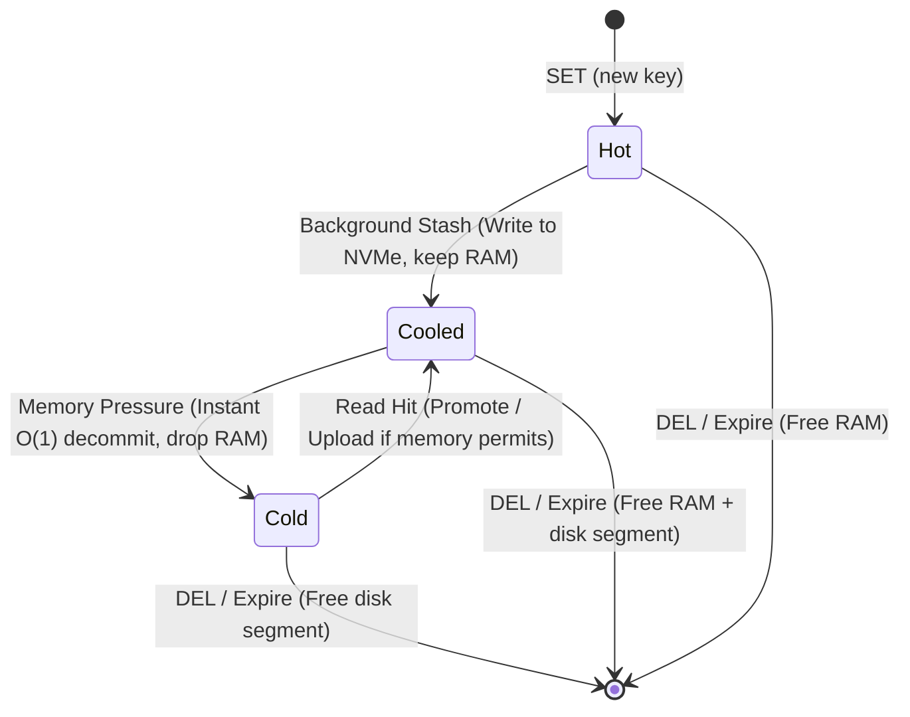
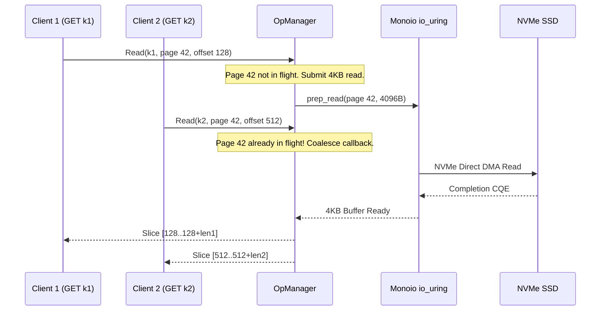
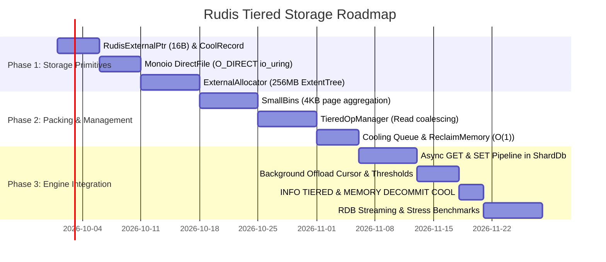

# Design Document: SSD Tiered Storage Engine for `rudis` (Dragonfly-Inspired)

## 1. Executive Summary & Motivation

Modern in-memory stores like Redis deliver sub-millisecond response times by keeping all data in DRAM. However, DRAM is expensive (~$4–$6/GB), power-hungry, and strictly capacity-limited. Modern NVMe SSDs offer hundreds of thousands to millions of IOPS with read latencies in the 10–30 microsecond range at 1/15th to 1/30th the cost of DRAM (~$0.15–$0.30/GB).

In typical cache and database workloads, key access follows a Zipfian/Pareto distribution: **10–20% of keys account for 80–90% of requests**. The remaining 80% represents cold or cooling data that wastes expensive DRAM.

By studying Dragonfly's production SSD data tiering architecture (`dfly::tiering::*`), this document presents a comprehensive, native Rust design for `rudis`:
- **Larger-Than-Memory Capacity**: Transparently scale datasets 2x–5x beyond physical memory limits.
- **Thread-Per-Core Shared-Nothing I/O**: Each `rudis` worker thread drives an independent Linux `io_uring` instance and owns a dedicated NVMe storage file (`shard-{id}.tier`), eliminating cross-core locks and maximizing NVMe queue depth.
- **Three-State Value Lifecycle (Hot, Cooled, Cold)**: Immediate $O(1)$ zero-I/O memory reclamation under pressure.
- **Small-Value Bin Packing (`SmallBins`)**: Coalesce small items ($< 2$ KB) into 4 KB aligned direct I/O pages, avoiding write/space amplification.
- **Page Read Coalescing (`OpManager`)**: Deduplicate concurrent read requests targeting values residing on the same 4 KB disk page.
- **Mimalloc-Inspired `ExternalAllocator`**: Manage 256 MB segments and free disk ranges via interval trees.
- **Direct I/O (`O_DIRECT`)**: Bypass Linux page cache to eliminate double caching and OS flush latency spikes.

---

## 2. Dragonfly Architectural Deep-Dive & Mapping to Rudis

Inspection of Dragonfly's implementation (`dragonfly/src/server/tiering/*` and `core/compact_object.h`) reveals six modular pillars that form the foundation of our `rudis` design:

```
+---------------------------------------------------------------------------------------------------------+
|                                    Dragonfly vs. Rudis Tiering Architecture                             |
+------------------------------+------------------------------------+-------------------------------------+
| Component                    | Dragonfly Implementation           | Rudis Proposed Implementation       |
+------------------------------+------------------------------------+-------------------------------------+
| In-Memory Pointer            | `CompactObj::ExternalPtr` (16B)    | `RudisExternalPtr` (16B) in `RudisValue`|
| Cooling Buffer               | `TieredCoolRecord` (48B, intrusive)| `CoolRecord` in intrusive LRU list  |
| Small Value Packing          | `SmallBins` (4KB page packing)     | `SmallBins` with binary page layout |
| Read Coalescing & Ops Mgmt   | `OpManager`                        | `TieredOpManager` over Monoio futures|
| Disk Allocator               | `ExternalAllocator` (mimalloc model)| `ExternalAllocator` with RangeTree  |
| Direct I/O Driver            | `io_uring` via `UringProactor`     | `monoio::IoUringDriver` + `O_DIRECT`|
+------------------------------+------------------------------------+-------------------------------------+
```

---

## 3. High-Level System Architecture

In `rudis`, each shard is pinned to a physical core and runs an isolated `monoio` event loop driving an independent `io_uring` ring:

```text
                           Client Connections
                                   │
                     (SO_REUSEPORT Kernel Balancing)
                      ┌────────────┴────────────┐
                      ▼                         ▼
              ┌───────────────┐         ┌───────────────┐
              │    Core 0     │         │    Core 1     │
              │ Monoio Runtime│         │ Monoio Runtime│
              │ (io_uring)    │         │ (io_uring)    │
              ├───────────────┤         ├───────────────┤
              │    Shard 0    │         │    Shard 1    │
              │  RudisTable   │         │  RudisTable   │
              ├───────────────┤         ├───────────────┤
              │ TieredStorage │         │ TieredStorage │
              │ ┌───────────┐ │         │ ┌───────────┐ │
              │ │ OpManager │ │         │ │ OpManager │ │
              │ ├───────────┤ │         │ ├───────────┤ │
              │ │ SmallBins │ │         │ │ SmallBins │ │
              │ ├───────────┤ │         │ ├───────────┤ │
              │ │ ExtAlloc  │ │         │ │ ExtAlloc  │ │
              │ └───────────┘ │         │ └───────────┘ │
              └───────┬───────┘         └───────┬───────┘
                      │ (O_DIRECT io_uring)     │ (O_DIRECT io_uring)
                      ▼                         ▼
              ┌───────────────┐         ┌───────────────┐
              │ NVMe File 0   │         │ NVMe File 1   │
              │ shard-0.tier  │         │ shard-1.tier  │
              └───────────────┘         └───────────────┘
```

---

## 4. In-Memory Data Structures

### 4.1 Compact 16-Byte `RudisExternalPtr`

Following Dragonfly's `CompactObj::ExternalPtr`, we define a packed 16-byte struct that replaces `RudisValue::String` in `RudisTable`:

```rust
#[derive(Clone, Copy, Debug, PartialEq, Eq)]
#[repr(u8)]
pub enum ExternalRep {
    String = 0,
    SerializedMap = 1,
    ListNode = 2,
}

/// 16-byte packed external storage pointer.
/// Fits cleanly in RudisValue without bloating entry size.
#[derive(Clone, Copy, Debug)]
#[repr(C, packed)]
pub struct RudisExternalPtr {
    /// Total serialized size of payload on disk (up to 4 GB)
    pub serialized_size: u32,
    
    /// Bitfield:
    /// - bits 0..11:  page_offset (0..4095 inside the 4KB page)
    /// - bit 12:      is_cool (1 if in memory cooling buffer, 0 if cold disk-only)
    /// - bits 13..14: representation (ExternalRep: String, Hash, List)
    /// - bit 15:      reserved
    pub flags_and_offset: u16,
    
    /// Cached prefix / header bytes (2 bytes)
    pub header_bytes: [u8; 2],
    
    /// Union: points to in-memory CoolRecord if is_cool == 1,
    /// or holds 32-bit disk page index (page_index * 4KB = up to 16 TB file) if cold.
    pub location: ExternalLocation,
}

#[derive(Clone, Copy)]
#[repr(C)]
pub union ExternalLocation {
    pub cold: ColdLocation,
    pub cool_record: *mut CoolRecord,
}

#[derive(Clone, Copy, Debug)]
#[repr(C, packed)]
pub struct ColdLocation {
    pub page_index: u32,
    pub reserved: u32,
}

impl RudisExternalPtr {
    #[inline(always)]
    pub fn page_offset(&self) -> u16 {
        self.flags_and_offset & 0x0FFF
    }

    #[inline(always)]
    pub fn is_cool(&self) -> bool {
        (self.flags_and_offset & 0x1000) != 0
    }

    #[inline(always)]
    pub fn rep(&self) -> ExternalRep {
        match (self.flags_and_offset >> 13) & 0x03 {
            0 => ExternalRep::String,
            1 => ExternalRep::SerializedMap,
            _ => ExternalRep::ListNode,
        }
    }

    #[inline(always)]
    pub fn disk_segment(&self) -> (u64, u32) {
        unsafe {
            if self.is_cool() {
                let rec = &*self.location.cool_record;
                let offset = (rec.page_index as u64 * 4096) + self.page_offset() as u64;
                (offset, self.serialized_size)
            } else {
                let offset = (self.location.cold.page_index as u64 * 4096) + self.page_offset() as u64;
                (offset, self.serialized_size)
            }
        }
    }
}
```

### 4.2 Intrusive `CoolRecord` (Cooling Storage)

When a value is stashed to NVMe, it is initially kept in a **Cooling Buffer** to prevent disk thrashing if accessed immediately:

```rust
pub struct CoolRecord {
    pub key_hash: u64,
    pub value: Bytes,
    pub page_index: u32,
    pub db_index: u16,
    // Intrusive doubly-linked list pointers for LRU eviction
    pub prev: *mut CoolRecord,
    pub next: *mut CoolRecord,
}
```

---

## 5. Three-State Lifecycle & Instant Decommit



### The Power of the Cooled State: Zero-I/O Decommit
When memory usage reaches high thresholds:
- Redis ElastiCache must synchronously write cold pages to disk or drop entries.
- Dragonfly and `rudis` simply execute **`ReclaimMemory(goal_bytes)`**:
  1. Pop `CoolRecord` items from the cooling LRU list.
  2. Overwrite the `ExternalLocation` union in `RudisExternalPtr` from `cool_record` pointer to `ColdLocation { page_index }`.
  3. Clear the `is_cool` bit.
  4. Free the `Bytes` payload and `CoolRecord` struct.
  5. **No disk I/O occurs!** The data is already on NVMe. Immediate gigabytes of DRAM are reclaimed in microseconds.

---

## 6. Small Values Aggregation (`SmallBins`)

Direct I/O (`O_DIRECT`) requires strict 4096-byte alignment. Storing small values (64B–2KB) directly in 4KB pages would result in catastrophic space amplification ($32\times$) and NVMe wear.

### 6.1 Binary 4 KB Page Serialization Format

Following Dragonfly's `SmallBins::SerializeBin`, `rudis` packs multiple entries into a single 4KB page:

```text
+-------------------------------------------------------------------------------+
|                       4096-Byte SmallBins Page Layout                         |
+-------------------------------------------------------------------------------+
| Header:                                                                       |
|   num_entries: u16 (2 Bytes)                                                  |
+-------------------------------------------------------------------------------+
| Key Metadata Index Table (num_entries * 10 Bytes):                            |
|   Entry 0: [db_id: u16] [key_hash: u64]                                       |
|   Entry 1: [db_id: u16] [key_hash: u64]                                       |
|   ...                                                                         |
+-------------------------------------------------------------------------------+
| Value Blob Section:                                                           |
|   Entry 0: [val_len: u16] [payload bytes...]                                  |
|   Entry 1: [val_len: u16] [payload bytes...]                                  |
|   ...                                                                         |
+-------------------------------------------------------------------------------+
| Free Slack Space (zeros to 4096 boundary)                                     |
+-------------------------------------------------------------------------------+
```

### 6.2 Stash Flow
1. Incoming candidate values ($< 2$ KB) are appended to the active `SmallBins::current_bin`.
2. When the accumulated serialized size reaches 4096 bytes, `current_bin` is sealed.
3. An aligned 4KB DMA buffer is filled and submitted via `io_uring::write_at`.
4. Upon write completion (`ReportStashed`), each key receives its exact `page_index` and `page_offset`.

### 6.3 Defragmentation
When individual keys within a stashed 4KB bin are updated or deleted, `SmallBins` decrements the bin's active count. When occupancy drops below 25%, the bin is flagged for compaction: surviving items are read, migrated to a fresh bin, and the old 4KB block is returned to `ExternalAllocator`.

---

## 7. `OpManager`: In-Flight Operations & Read Coalescing

Dragonfly's `OpManager` solves a critical performance challenge: **multiple keys residing on the same 4KB disk page**.



### Key Responsibilities
1. **Coalesced Reads**: Multiple concurrent reads targeting different slots within the same 4KB page share a single disk read operation and a single DMA buffer.
2. **Pending Stash Cancellation**: If a client issues `DEL` or `SET` for a key with an in-flight stash, `OpManager` marks the operation canceled, avoiding disk corruption.
3. **Write Backpressure**: Tracks `pending_stash_bytes`. If pending writes exceed `--tiered_max_pending_stash_bytes` (default 16MB), incoming write commands yield to let NVMe drain.

---

## 8. `ExternalAllocator`: Mimalloc-Style Disk Extent Manager

Dragonfly's `ExternalAllocator` applies memory allocation techniques (`mimalloc`) to disk offset management:

### 8.1 Segment & Page Hierarchy
- **Segments**: The backing file expands in 256 MB chunks. Segment ID = $\text{offset} \gg 28$.
- **Page Classes**:
  - **Small (2 MB segments)**: For block sizes up to 128 KB.
  - **Medium (16 MB segments)**: For block sizes 128 KB to 1 MB.
  - **Large**: Direct multi-page allocations for payloads $> 1$ MB.
- **Free Extents**: Managed by a range tree (`BTreeMap<u64, u64>`) that merges adjacent freed blocks and guarantees $O(\log N)$ best-fit allocations.

---

## 9. Thresholds & Dynamic Memory Control

```text
DRAM Capacity (maxmemory)
▲
│ 100% ──────────── Hard Eviction / Error (OOM Protection)
│
│  80% ──────────── tiered_upload_threshold (Disable promotion; stream cold reads)
│
│  60% ──────────── tiered_offload_threshold (Start background sampling offload)
│
│  40% ──────────── Normal State (Keep hot data in RAM)
▼
```

1. **`tiered_offload_threshold` (Default: 0.40 free memory)**:
   - When free memory drops below 40%, a background timer runs `RunOffloading()`.
   - Uses `RudisTable`'s sampling cursor to scan entries.
   - Values $\ge 64$ bytes are stashed to NVMe and moved to the cooling queue.
2. **`tiered_upload_threshold` (Default: 0.20 free memory)**:
   - When free memory is below 20%, reads for cold keys return the payload directly to the network socket buffer without promoting the key back into DRAM.
3. **`MEMORY DECOMMIT COOL`**:
   - Operator command to manually flush all cool items to cold storage, instantly freeing RAM.

---

## 10. Command-Line Flags & Observability

### Flags
- `--tiered_prefix <path>`: Base directory/prefix for per-shard backing files. Enables tiered storage.
- `--tiered_offload_threshold <ratio>`: Ratio of free memory to trigger background offload (default: `0.40`).
- `--tiered_upload_threshold <ratio>`: Ratio of free memory below which promotions stop (default: `0.20`).
- `--tiered_min_value_size <bytes>`: Minimum size for tiering eligibility (default: `64`).
- `--tiered_max_pending_stash_bytes <bytes>`: Max in-flight write bytes before throttling (default: `16MB`).
- `--tiered_max_file_size <bytes>`: Maximum disk capacity per shard file.

### `INFO TIERED` Output
```text
# Tiered Storage
tiered_status:enabled
tiered_prefix:/mnt/nvme/rudis
tiered_entries:2410980
tiered_entries_bytes:3145728000
tiered_cold_entries:2100000
tiered_cooled_entries:310980
tiered_ram_hits:12401920
tiered_ram_cool_hits:890420
tiered_ram_misses:650110
tiered_total_stashes:2600000
tiered_total_fetches:650110
tiered_total_deletes:189020
tiered_allocated_bytes:3422552064
tiered_capacity_bytes:107374182400
tiered_pending_read_cnt:8
tiered_pending_stash_cnt:3
```

---

## 11. Phased Implementation Plan for `rudis`



### Phase 1: Storage Primitives
- Implement `RudisExternalPtr` (16 bytes) and integrate with `RudisValue`.
- Build `DirectFile` over Monoio `io_uring` with `O_DIRECT` and pre-allocated DMA buffers.
- Implement `ExternalAllocator` managing 256MB file chunks and interval-tree free ranges.

### Phase 2: Packing & Operations Management
- Implement `SmallBins` to pack values $< 2$ KB into 4KB pages with header index metadata.
- Implement `TieredOpManager` for page read coalescing and pending stash cancellation.
- Implement the intrusive `CoolRecord` LRU queue and $O(1)$ zero-I/O memory reclamation.

### Phase 3: Engine Integration & Telemetry
- Update `ShardDb` command execution (`execute_local_command`) to handle async cold reads without blocking peer tasks.
- Implement dynamic watermark evaluation (`tiered_offload_threshold`, `tiered_upload_threshold`).
- Add `INFO TIERED` and `MEMORY DECOMMIT COOL`.
- Benchmark against Dragonfly and Redis on local NVMe SSDs.
