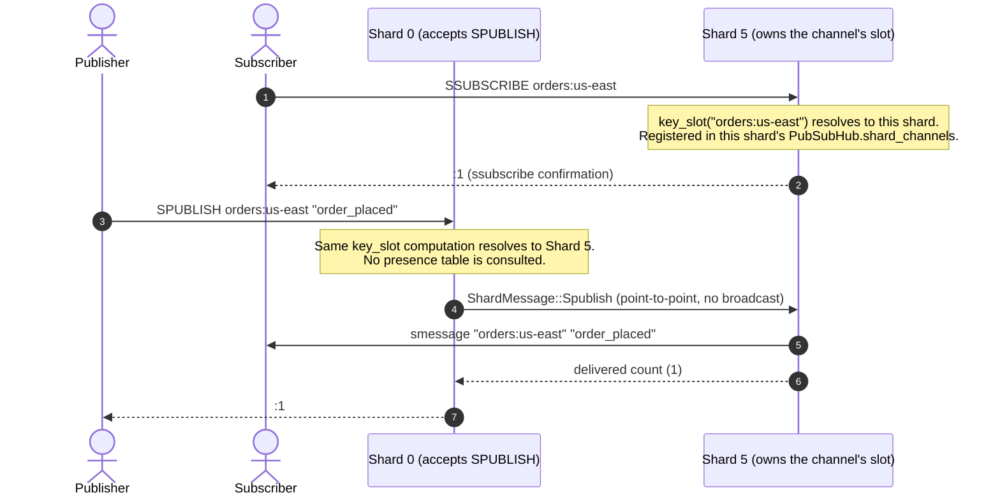

# Pub/Sub Architecture & Sharded Messaging

This document explains how Rudis implements the Redis Publish/Subscribe messaging model
(`SUBSCRIBE`, `PSUBSCRIBE`, `PUBLISH`) and Redis 7's sharded Pub/Sub extension (`SSUBSCRIBE`,
`SPUBLISH`, `SUNSUBSCRIBE`) inside its thread-per-core, shared-nothing server architecture. It
covers the striped presence bitmask that avoids broadcasting every publish to every worker
shard, CRC16 slot routing for sharded channels, RESP2/RESP3 frame delivery, and subscriber
backpressure. All claims below are verified against `src/pubsub.rs` and the routing logic in
`src/router.rs`; for exhaustive struct-level detail, see
[`docs/internal/19_pubsub.md`](internal/19_pubsub.md) (and
[`docs/design/19_pubsub.md`](design/19_pubsub.md) for the underlying design rationale).

---

## 1. The Architectural Challenge

Rudis runs one independent worker per CPU core; each worker (shard) owns its own connections,
its own event loop, and its own in-memory subscriber registry, with no shared mutable state
between shards (see the reactor runtime and sharding design docs). Pub/Sub subscriptions,
however, are logically global: a client subscribed on shard 0 must receive a message a different
client publishes from shard 7, even though nothing about the underlying storage forces those two
connections to interact.

A naive implementation has two unattractive options: broadcast every `PUBLISH` to every shard
unconditionally (correct, but the cost scales with shard count regardless of how many shards
actually have a relevant subscriber), or centralize subscriber bookkeeping behind a single lock
(avoids the broadcast cost, but reintroduces the cross-core lock contention the thread-per-core
design is meant to eliminate). Rudis instead keeps subscription state fully local to the shard
that accepted each connection, and uses a small, approximate piece of shared state — a presence
bitmask — to let a publisher skip shards it can be confident hold no relevant subscriber,
without requiring any shard to expose its exact subscriber list to others.

---

## 2. Three Channel Classes

| Class | Commands | Routing Scope | Cross-Shard Mechanism |
| :--- | :--- | :--- | :--- |
| **Standard channels** | `PUBLISH`, `SUBSCRIBE`, `UNSUBSCRIBE` | Any channel, any shard | Presence-bitmask-filtered fan-out (§4) |
| **Pattern channels** | `PSUBSCRIBE`, `PUNSUBSCRIBE` | Glob pattern over channel names | Same presence bitmask (pattern bit is unstriped — see §4) |
| **Sharded channels (Redis 7)** | `SPUBLISH`, `SSUBSCRIBE`, `SUNSUBSCRIBE` | Exactly one shard, chosen by `CRC16(channel) % 16384` | Point-to-point routing, no fan-out (§5) |

Standard and pattern subscribers share one registry (`PubSubHub.channels`/`.patterns`) and one
presence table per shard; sharded-channel subscribers use a separate registry
(`PubSubHub.shard_channels`) that is never consulted by pattern matching — a `PSUBSCRIBE`
subscriber never receives `SPUBLISH` traffic, and vice versa.

---

## 3. Delivery Semantics

Pub/Sub delivery in Rudis is **at-most-once and best-effort**, matching upstream Redis:

- Messages are never persisted. A subscriber must be registered at the moment a message is
  published to receive it; there is no backlog or replay on reconnect.
- A client receives a `message` frame for each exact `SUBSCRIBE`d channel that matches, and a
  separate `pmessage` frame for each `PSUBSCRIBE`d pattern that glob-matches the channel — a
  client subscribed to both an exact channel and a matching pattern receives two frames for one
  publish.
- Sharded-channel subscribers receive `smessage` frames only via `SPUBLISH` on the exact channel
  they subscribed to.
- RESP2 clients receive ordinary array replies (`*3\r\n...` for `message`/`smessage`,
  `*4\r\n...` for `pmessage`); clients that negotiated RESP3 via `HELLO 3` receive the same
  payload framed as an out-of-band push type (`>3\r\n...`/`>4\r\n...`) instead. This is decided
  per subscriber at delivery time from state tracked in the local hub, not by a fixed
  server-wide protocol choice.
- Delivery to a given subscriber can fail silently if that subscriber's queue is full (§6); a
  dropped message is not retried and is not counted in the integer `PUBLISH`/`SPUBLISH` returns
  to the publisher.
- There is no cross-shard delivery-ordering guarantee: two publishes to the same channel issued
  against different shards in quick succession may be observed by a subscriber in either order.

---

## 4. Standard/Pattern Pub/Sub: the Striped Presence Bitmask

```
                          PUBLISH "alerts" "system_ready"
                                         │
                   ┌─────────────────────┴─────────────────────┐
                   │ hash_key("alerts") % 16 selects a stripe   │
                   │ Load that stripe's AtomicU64 bitmask,      │
                   │ OR'd with the (unstriped) pattern bitmask  │
                   └─────────────────────┬─────────────────────┘
                                         │
                        Bitmask has bits 0 and 2 set
                                         │
                        ┌────────────────┴────────────────┐
                        ▼                                 ▼
                Deliver locally first              Send ShardMessage::Publish
                (this shard's own hub)              to shard 0 and shard 2 only
                                                     (every other shard skipped)
```

Each shard maintains, in a process-wide `ShardedPresenceTable` keyed by listening port, 16
`AtomicU64` "channel stripe" bitmasks plus one unstriped `AtomicU64` "pattern presence" bitmask.
When a client's `SUBSCRIBE`/`PSUBSCRIBE` on some shard makes that shard's local subscriber count
for a channel (or for patterns generally) transition from zero to one, that shard sets its bit
in the corresponding bitmask; the reverse transition (last local subscriber removed) clears it.

`PUBLISH` on a given shard: (1) delivers to that shard's own local subscribers immediately by
scanning its own `PubSubHub`; (2) loads `interested_shards(channel)` — the channel's stripe
bitmask OR'd with the pattern bitmask; (3) sends one message to every *other* shard whose bit is
set, all dispatched before awaiting any reply; (4) sums each contacted shard's reported delivery
count into the total returned to the client.

Because the bitmask is striped by a hash of the channel name rather than keyed by the literal
channel, two unrelated channel names can map to the same stripe and cause a shard to be
contacted even though it has no subscriber for the channel actually published — a false
positive that costs one wasted round trip. This can never cause a missed delivery: the
contacted shard still performs an exact match against its own authoritative subscriber map
before delivering anything or reporting a nonzero count. `PUBSUB CHANNELS`/`PUBSUB NUMSUB`/
`PUBSUB NUMPAT` bypass the bitmask entirely and query every shard unconditionally, since they
must enumerate exact global state rather than decide "is it worth asking."

---

## 5. Sharded Pub/Sub: CRC16 Slot Routing

Redis 7's sharded Pub/Sub trades the standard model's "any shard might have a subscriber"
flexibility for deterministic, O(1) routing: a shard channel's target is computed with exactly
the same slot function Rudis uses for key routing (`key_slot`, CRC16/XMODEM modulo 16384,
respecting `{hash-tag}` syntax), mapped to a shard via `slot_to_shard`.



If the accepting shard happens to already own the channel's slot, delivery is entirely local and
no inter-shard message is sent at all. Unlike standard `PUBLISH`, there is no presence-bitmask
lookup and no possibility of contacting the wrong shard's neighbors — routing is a pure function
of the channel name.

---

## 6. Frame Delivery & Backpressure

- **Reference-counted payloads.** Messages are carried as `bytes::Bytes`; the RESP frame for a
  given publish is constructed once per protocol version actually needed among the recipients on
  a shard (not once per recipient), and shared to each subscriber via a cheap `Bytes::clone`
  (an atomic reference-count bump), not a per-subscriber allocation or copy.
- **Bounded per-subscriber delivery queue.** Each subscribing connection's dedicated write task
  drains a bounded `flume` channel (capacity 4096 frames) that publishers deliver into via a
  non-blocking send; delivery to a subscriber whose queue is momentarily full simply fails for
  that one message rather than blocking the publisher.
- **Output-buffer-limit enforcement, not unbounded backlog.** Independently of the queue's frame
  capacity, the connection's write task tracks the subscriber's outstanding queued byte count
  against the server's configured Pub/Sub client-class output-buffer limits (hard limit and
  soft-limit-with-grace-period); a subscriber that persistently exceeds them has its connection
  closed by the server rather than being allowed to accumulate an unbounded backlog.
