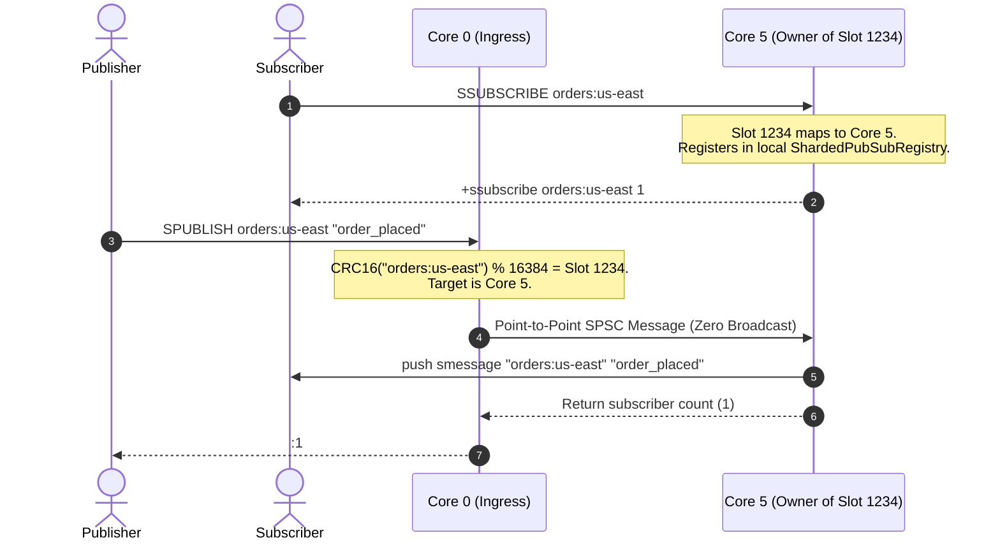

# Pub/Sub Architecture & Sharded Messaging

This document describes how Rudis implements the Publish-Subscribe (Pub/Sub) messaging paradigm within its shared-nothing, multi-threaded architecture. It covers the striped presence bitmask that eliminates cross-shard broadcast storms, Redis 7 slot-bound sharded pub/sub (`SPUBLISH`), zero-copy `Bytes` delivery, and bounded subscriber backpressure.

---

## 1. Overview & Architectural Challenge

In a thread-per-core shared-nothing datastore, handling Pub/Sub presents a unique challenge:
- Subscriptions are held by connections scattered across arbitrary worker threads.
- If a publisher on Core 0 issues `PUBLISH channel msg`, a naive implementation must broadcast the message to **all $N$ worker threads**, even if none of them have subscribers for that channel.
- Under high-frequency publishing (e.g. 1M msg/s across 16 cores), naive broadcasting consumes hundreds of millions of cross-core channel hops, stalling worker reactors.

Rudis solves this with two major innovations:
1. **Striped Shard Presence Bitmask**: A 16-stripe atomic bitmask tracks which worker shards actually host subscribers for a given channel. Publishers bypass any shard whose presence bit is `0`.
2. **Redis 7 Slot-Bound Sharded Pub/Sub (`SPUBLISH`, `SSUBSCRIBE`)**: Messages are strictly routed to the single shard owning the channel's CRC16 slot (`CRC16(channel) % 16384`), converting an $O(N)$ broadcast into a point-to-point $O(1)$ operation.

---

## 2. Three Flavors of Pub/Sub

| Flavor | Commands | Routing Scope | Cross-Shard Overhead |
| :--- | :--- | :--- | :---: |
| **Standard Pub/Sub** | `PUBLISH`, `SUBSCRIBE`, `UNSUBSCRIBE` | Global (all channels) | Filtered via Striped Shard Presence Bitmask |
| **Pattern Pub/Sub** | `PSUBSCRIBE`, `PUNSUBSCRIBE` | Global (glob patterns) | Dispatched to subscribed shard threads |
| **Sharded Pub/Sub (Redis 7)** | `SPUBLISH`, `SSUBSCRIBE`, `SUNSUBSCRIBE` | Slot-Bound (`CRC16(c) % 16384`) | **Zero Broadcast**: Point-to-point slot routing |

---

## 3. Primary Data Structures

| Type | Location | Architectural Role |
| :--- | :--- | :--- |
| `PubSubHub` | `src/pubsub.rs` | Global registry tracking active channel subscriptions and striped presence bitmasks. |
| `StripedPresenceBitmask` | `src/pubsub.rs` | 16-stripe atomic bitmask array (`AtomicU64`) recording subscriber presence per shard. |
| `ShardPubSub` | `src/pubsub.rs` | Thread-local subscription table mapping channels to local client connection handles. |
| `ShardedPubSubRegistry` | `src/pubsub.rs` | Slot-bound subscription map managing `SSUBSCRIBE` bindings on individual shards. |
| `PubSubMessage` | `src/pubsub.rs` | Zero-copy reference-counted message wrapper utilizing `bytes::Bytes` for payload sharing. |

---

## 4. Striped Shard Presence Bitmask

To prevent broadcast storms on global `PUBLISH` commands, Rudis maintains a striped bitmask of active subscriber shards:

```
                          PUBLISH "alerts" "system_ready"
                                         │
                   ┌─────────────────────┴─────────────────────┐
                   │ Calculate Hash("alerts") & Select Stripe  │
                   │ Check AtomicU64 Bitmask for Active Shards │
                   └─────────────────────┬─────────────────────┘
                                         │
                       Bitmask = 0b0000_0000_0000_0101
                                (Only Shards 0 and 2)
                                         │
                        ┌────────────────┴────────────────┐
                        ▼                                 ▼
                     Shard 0                           Shard 2
              (Deliver to Clients)              (Deliver to Clients)
              
              [Shards 1, 3..15 bypassed with ZERO channel messages]
```

* When a client executes `SUBSCRIBE channel`, its local shard registers itself in the global `PubSubHub` and sets its bit in the channel's stripe.
* When a publisher executes `PUBLISH channel`, it loads the bitmask via an atomic acquire operation. It only dispatches messages to shards with active subscribers, eliminating unnecessary CPU wakeups.

---

## 5. Redis 7 Slot-Bound Sharded Pub/Sub

Redis 7 introduced Sharded Pub/Sub to eliminate cluster broadcast overhead by binding channels to cluster slots:

$$\text{slot} = \text{CRC16}(\text{channel}) \pmod{16384}$$



1. **Direct Routing**: Publishers route `SPUBLISH` commands straight to the shard that owns the slot.
2. **Push Frame Delivery**: Subscribers receive standardized RESP3 `smessage` push arrays:
   ```
   >3
   $8
   smessage
   $14
   orders:us-east
   $12
   order_placed
   ```

---

## 6. Zero-Copy Delivery & Bounded Backpressure

Pub/Sub workloads can easily overwhelm slow subscriber connections, leading to unbounded memory consumption and OOM crashes. Rudis protects itself using:

1. **Zero-Copy `bytes::Bytes` Buffers**: Message payloads are wrapped in reference-counted `Bytes` slices. A single allocation is shared across all subscribers on all shards with zero buffer duplication.
2. **Bounded Subscriber Queues**: Each connection has a bounded egress channel buffer (1,024 frames).
3. **Slow Subscriber Eviction**: If a subscriber's egress buffer fills completely and fails to drain, Rudis closes the connection rather than allowing unbounded memory accumulation.
