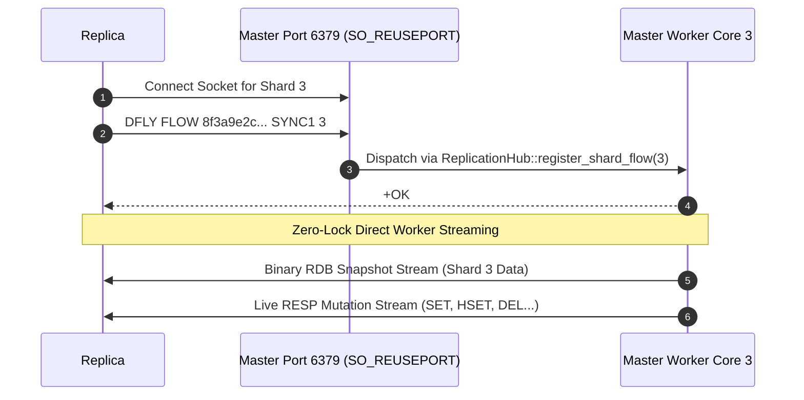

# Replication Design & Multi-Flow Architecture

This document describes how Rudis implements high-throughput, multi-threaded replication. Rudis supports two distinct replication protocols:
1. **Dragonfly Multi-Flow Parallel Replication (`DFLY FLOW`)**: Ultra-high-throughput parallel TCP streaming direct to worker cores.
2. **Standard Redis Replication (`PSYNC2`)**: Wire-compatible single-connection replication supporting standard Redis and Valkey replicas.

---

## 1. Two Roles, Two State Machines

Replication coordinates two state machines across a control connection plus one dedicated connection **per worker shard** ("flow"):

```mermaid
flowchart LR
    start((start)) --> PREPARATION
    PREPARATION -->|REPLCONF capa dragonfly| DFLY_HANDSHAKE
    DFLY_HANDSHAKE -->|DFLY FLOW (all shards)| FULL_SYNC
    FULL_SYNC -->|Snapshot Replay Complete| STABLE_SYNC
    PREPARATION -->|Standard PSYNC| REDIS_SYNC
    REDIS_SYNC -->|Single-Socket Stream| STABLE_SYNC
    PREPARATION --> CANCELLED
    FULL_SYNC --> CANCELLED
    STABLE_SYNC --> CANCELLED
```

* **Master Side**: One session per connected replica, transitioning from `PREPARATION` $\to$ `FULL_SYNC` $\to$ `STABLE_SYNC`.
* **Replica Side**: Discovers master capabilities, establishes parallel flow connections, streams snapshots concurrently, and switches to live mutation replication.

---

## 2. Key Terminology

* **LSN (Log Sequence Number)**: A per-shard, monotonically increasing 64-bit integer tracking journal and mutation entries. Each worker core maintains its own independent LSN sequence.
* **Flow**: A dedicated TCP connection bound directly to a specific worker core. A server running $N$ shards utilizes $N$ parallel flows (`flow_id` $\in [0, N-1]$).
* **`master_replid`**: A 40-character hex string generated once per master process lifetime, identifying the current replication timeline.
* **`sync_id`**: A unique session token (e.g. `SYNC1`) generated by the master upon greeting to bind per-shard `DFLY FLOW` sockets to the control session.

---

## 3. Primary Data Structures

| Type | Location | Architectural Role |
| :--- | :--- | :--- |
| `ReplicationHub` | `src/replication.rs` | Coordinates global replication state, flow registration, and command propagation. |
| `ReplicaInfo` | `src/replication.rs` | Tracks active replica metadata: role (`Master`/`Slave`), client port, and capabilities. |
| `ShardFlow` | `src/replication.rs` | Represents an active TCP socket streaming mutations directly from a worker core. |
| `MasterFlowSender` | `src/replication.rs` | Thread-local sender channel pushing shard-local mutations into the flow socket buffer. |
| `PsyncResult` | `src/replication.rs` | Encapsulates replication handshake negotiation (`FullResync`, `PartialSync`, `WaitOffset`). |

---

## 4. Handshake Protocol (`REPLCONF capa dragonfly`)

A replica begins synchronization by connecting to the master on its primary port and issuing:

1. `PING` $\to$ `+PONG`
2. `REPLCONF listening-port <port>` $\to$ `+OK`
3. `REPLCONF capa eof capa psync2` $\to$ `+OK`
4. `REPLCONF capa dragonfly`

Upon receiving `REPLCONF capa dragonfly`, the Rudis master identifies the client as a high-throughput multi-core replica and responds with a multi-bulk array:

```
*5
$40
<master_replid>
$5
SYNC1
:16                     <-- Number of master shard flows
:1                      <-- Protocol version
$40
<lineage_id>
```

This response informs the replica that the master has 16 worker cores and has assigned session identifier `SYNC1`.

---

## 5. Per-Shard Parallel TCP Flows (`DFLY FLOW`)

After completing the control handshake, the replica opens $N$ independent TCP connections to the master port (one for each shard), issuing:

```
DFLY FLOW <master_replid> <sync_id> <shard_id> [<lsn>]
```

Example for Shard 3:
```
DFLY FLOW 8f3a9e2c4b... SYNC1 3
```



### Why Multi-Flow Replication Outperforms Single-Socket Replication:
1. **Elimination of Master Central Bottleneck**: In single-socket replication (Redis/Valkey), all mutations across 16–64 cores must funnel into a single TCP socket buffer, causing CPU serialization and socket lock contention.
2. **Zero-Lock Thread-Direct Streaming**: In Rudis, worker threads stream mutations directly to their own dedicated TCP sockets without crossing thread boundaries or taking locks.
3. **Linear Throughput Scaling**: Replication egress bandwidth scales linearly with core count (crossing 60+ Gbps on high-speed networks).
